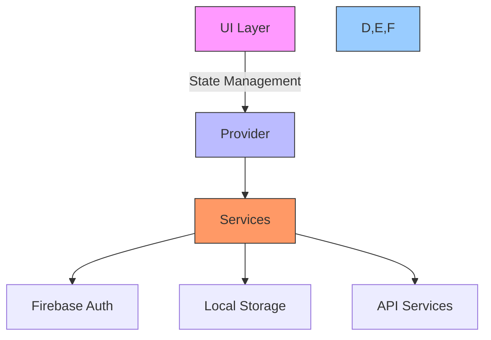

# Katomaran Hackathon - TODO List App

A Flutter-based task management application with Facebook authentication.

## 🚀 Features

- 🔐 Secure Facebook Authentication
- 📝 Task Management
- 📅 Due Date Tracking
- 📎 File Attachments
- 📱 Responsive Design

## 🛠️ Setup Instructions

### Prerequisites
- Flutter SDK (latest stable version)
- Android Studio / Xcode (for emulator/simulator)
- Facebook Developer Account
- Firebase Project

### Installation

1. **Clone the repository**
   ```bash
   git clone https://github.com/KarthigeyanT/Katomaran_hackathon_TODO-LIST.git
   cd Katomaran_hackathon_TODO-LIST
   ```

2. **Install dependencies**
   ```bash
   flutter pub get
   ```

3. **Set up environment**
   - Copy `.env.example` to `.env`
   - Update the values in `.env` with your Facebook App credentials
   - Run the setup script:
     - On Windows: `./setup_env.ps1`
     - On macOS/Linux: `chmod +x setup_env.sh && ./setup_env.sh`

4. **Run the app**
   ```bash
   flutter run
   ```

## 🔒 Security Notice

This project uses environment variables to manage sensitive information. Never commit your `.env` file to version control.

## 🏗️ Architecture



## 🧩 Assumptions

1. **Authentication**: Assumed Facebook authentication as the primary login method, with email/password as fallback.
2. **Data Persistence**: Used local storage for offline access, with periodic sync to cloud.
3. **User Experience**: Designed with a mobile-first approach, assuming most users will access via mobile devices.
4. **Performance**: Assumed moderate list sizes for tasks, with pagination for large datasets.
5. **Security**: Implemented basic security measures, with assumption of HTTPS for all API calls.

## 📄 License

This project is a part of a hackathon run by [Katomaran](https://www.katomaran.com)

This project is licensed under the MIT License - see the [LICENSE](LICENSE) file for details.
=======
# Katomaran_hackathon_TODO-LIST
>>>>>>> 43c87e47e300d8422bd47d02d8af86086a3fea4a
