# Katomaran Hackathon - TODO List App

[](https://katomaran-5516b.web.app)
[](https://drive.google.com/file/d/1LLjdNaNBXw9vsBovHc1gwkHKFS1bFfK0/view?usp=sharing)
[](https://opensource.org/licenses/MIT)
[](CONTRIBUTING.md)

A Flutter-based task management application with Facebook authentication. This application allows users to manage their tasks, set priorities, and track their progress in a clean and intuitive interface.

## 📹 Video Demonstration

Watch the [Video Explanation](https://drive.google.com/file/d/1LLjdNaNBXw9vsBovHc1gwkHKFS1bFfK0/view?usp=sharing) to see the application in action and understand its features and functionality.

## 📚 Documentation

- [📖 Project Documentation](#-project-documentation)
- [🚀 Features](#-features)
- [🛠️ Setup Instructions](#%EF%B8%8F-setup-instructions)
- [🏗️ System Architecture](#%EF%B8%8F-system-architecture)
- [🎯 App Features](#-app-features)
- [🔄 App Flow](#-app-flow)
- [🛠️ Technical Stack](#%EF%B8%8F-technical-stack)
- [📄 License](#-license)

## 🚀 Features

- 🔐 Secure Facebook Authentication
- 📝 Task Management
- 📅 Due Date Tracking
- 📎 File Attachments
- 📱 Responsive Design

## 🛠️ Setup Instructions

### Prerequisites
- Flutter SDK (latest stable version)
- Android Studio / Xcode (for emulator/simulator)
- Facebook Developer Account
- Firebase Project

### Installation

1. **Clone the repository**
   ```bash
   git clone https://github.com/KarthigeyanT/Katomaran_hackathon_TODO-LIST.git
   cd Katomaran_hackathon_TODO-LIST
   ```

2. **Install dependencies**
   ```bash
   flutter pub get
   ```

3. **Set up environment**
   - Copy `.env.example` to `.env`
   - Update the values in `.env` with your Facebook App credentials
   - Run the setup script:
     - On Windows: `./setup_env.ps1`
     - On macOS/Linux: `chmod +x setup_env.sh && ./setup_env.sh`

4. **Run the app**
   ```bash
   flutter run
   ```

## 🔒 Security Notice

This project uses environment variables to manage sensitive information. Never commit your `.env` file to version control.

## 🏗️ System Architecture

```mermaid
graph TD
    %% UI Layer
    UI[📱 UI Layer]
    UI -->|State Management| Provider[🔄 Provider State Management]
    
    %% Services Layer
    Provider --> Auth[🔐 Authentication]
    Provider --> TaskService[📋 Task Service]
    Provider --> Logger[📝 Logger Service]
    
    %% Authentication
    Auth -->|Uses| Facebook[🔵 Facebook Graph API]
    Auth -->|Uses| FirebaseAuth[🔐 Firebase Auth]
    
    %% Data Layer
    TaskService -->|Manages| LocalStorage[💾 Local Storage]
    
    %% Logging
    Logger -->|Logs to| Console[💻 Console]
    Logger -->|Saves to| LogStorage[📂 Log Files]
    
    %% Theme
    UI -->|Supports| Theme[🌓 Light/Dark Theme]
    
    %% Styling
    classDef ui fill:#4285F4,stroke:#1A73E8,color:white,rounded:10px
    classDef service fill:#34A853,stroke:#1E8E3E,color:white,rounded:10px
    classDef auth fill:#EA4335,stroke:#D23F31,color:white,rounded:10px
    classDef storage fill:#FBBC05,stroke:#F9AB00,color:black,rounded:10px
    classDef theme fill:#9C27B0,stroke:#7B1FA2,color:white,rounded:10px
    classDef external fill:#607D8B,stroke:#455A64,color:white,rounded:10px
    
    class UI,Provider ui
    class Auth,TaskService,Logger service
    class Facebook,FirebaseAuth auth
    class LocalStorage,LogStorage storage
    class Theme theme
    class Console external
```



## 🎯 App Features

### 🌟 Core Features
- **User Authentication**
  - Secure login with Facebook
  - Email/Password authentication
  - Session management

- **Task Management**
  - Create, Read, Update, Delete tasks
  - Task prioritization
  - Due date tracking
  - Task categories

- **Dashboard**
  - Task overview
  - Upcoming deadlines
  - Task completion statistics
  - Quick actions

- **Calendar Integration**
  - Monthly/weekly view
  - Task deadlines visualization
  - Quick add from calendar

- **Theme & UI**
  - Light/Dark mode toggle
  - Responsive design
  - Intuitive navigation

- **Crash Reporting**
  - Automatic crash logging
  - Error reporting
  - Debug information capture

## 🔄 App Flow

1. **Authentication**
   - User lands on login screen
   - Options: Facebook login or email/password
   - Secure authentication handling

2. **Home Screen**
   - Task list overview
   - Quick add task FAB
   - Filter and sort options

3. **Task Management**
   - Create new tasks with details
   - Edit existing tasks
   - Mark tasks as complete
   - Delete tasks with undo option

4. **Dashboard**
   - Task statistics
   - Completion rates
   - Productivity insights

5. **Calendar View**
   - Monthly overview
   - Task deadlines
   - Quick add from date selection

6. **Settings**
   - Theme toggle (Light/Dark)
   - App preferences
   - View app logs

## 🛠️ Technical Stack
- **Framework**: Flutter (Dart)
- **State Management**: Provider
- **Authentication**: Firebase Auth + Facebook SDK
- **Local Storage**: SharedPreferences + Hive
- **Logging**: Custom logger with file persistence
- **UI**: Material Design 3
- **Theming**: Dynamic theme switching
- **Platforms**: Android, iOS (responsive)

## 📄 Project Documentation

For more detailed information, please refer to the following documentation:

- [📜 Code of Conduct](CODE_OF_CONDUCT.md) - Our community guidelines
- [🔒 Security Policy](SECURITY.md) - Reporting vulnerabilities and security measures
- [🤝 Contributing Guide](CONTRIBUTING.md) - How to contribute to the project
- [📋 Changelog](CHANGELOG.md) - Version history and changes

## 📄 License

This project is a part of a hackathon run by [Katomaran](https://www.katomaran.com).

This project is licensed under the MIT License - see the [LICENSE](LICENSE) file for details.

## 🙏 Acknowledgments

- Built with ❤️ for Katomaran Hackathon
- Icons and illustrations from [Flutter Icons](https://api.flutter.dev/flutter/material/Icons-class.html)
